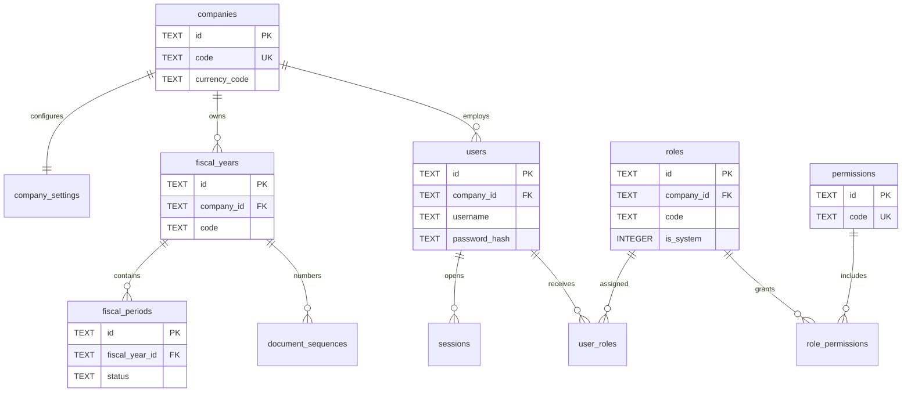
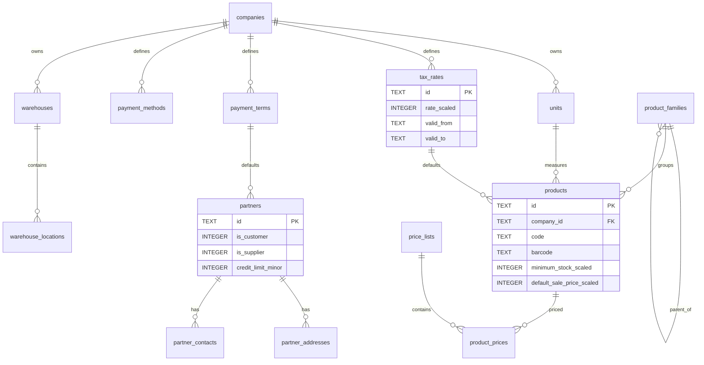
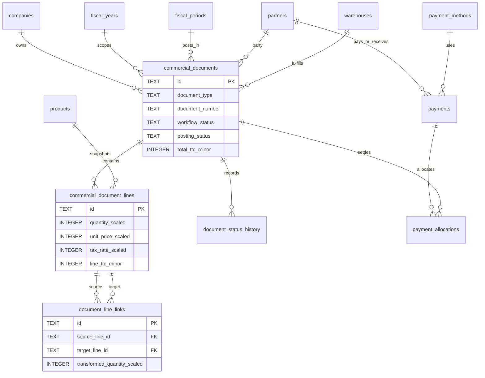
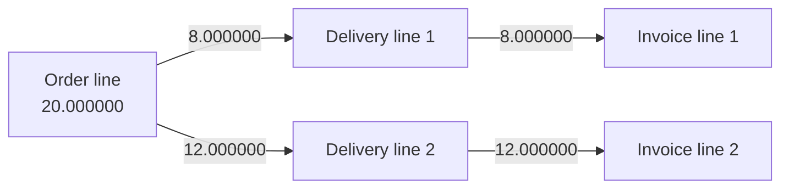
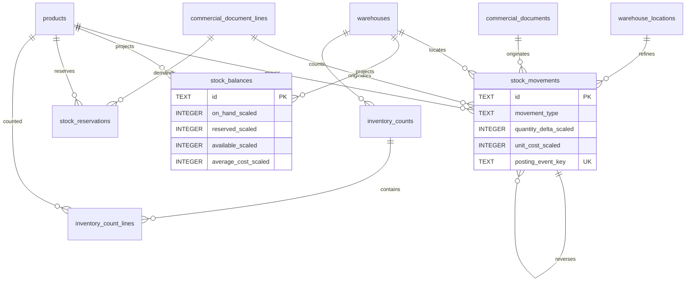
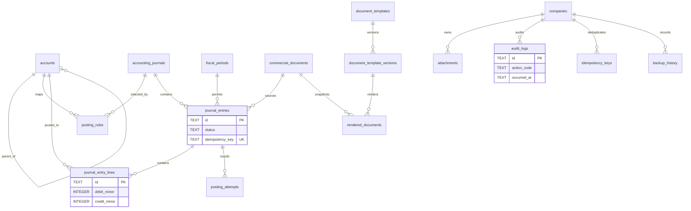

# POSMAN SQLite ERD

The schema is split by domain for readability. Mermaid does not express CHECK constraints, partial indexes, trigger behavior, or aggregate application-service invariants; those are documented in the data dictionary and database decisions.

## System, company, fiscal structure, and security

`app_migrations` is installation-scoped. System role templates and permissions are global safe reference data; no administrator is seeded.

## Reference data, catalog, and partners

## Commercial documents and quantity lineage

### Partial conversion path

One source line may feed several targets. Compatible source lines may feed one target. Remaining quantity is derived from source quantity minus linked transformed quantities.

## Inventory

`stock_movements` is append-only and authoritative. `stock_balances` is a disposable/rebuildable projection. Transfers use paired movements sharing `transfer_group_id`.

## Accounting, print history, audit, and backup

## Relationships not fully represented by Mermaid

- Human document numbers are unique by company, fiscal year, and document type.
- Product code and non-empty barcode uniqueness are company-scoped.
- Nullable location uniqueness uses expression indexes for balances and count lines.
- Posted immutability and append-only rules are trigger-protected.
- Journal balance and fiscal-period openness are validated on the `DRAFT` → `POSTED` transition.
- Aggregate over-conversion, company-scope consistency, CUMP, and stock authorization remain explicit Rust application-service invariants.
