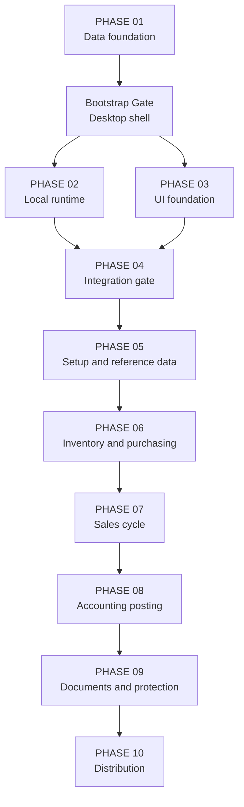

# POSMAN Master Engineering Roadmap — PHASE 01 to PHASE 10

> Status: continuity baseline and planning contract. PHASE 01–03 and the Bootstrap Gate are accepted facts. PHASE 04–10 are proposed delivery boundaries derived from the accepted Blueprint and prior architecture; they are not authorized merely because they appear here.

## 1. Why there are two roadmaps

The accepted [Product Blueprint](../spec/POSMAN-Blueprint-v1.md) defines seven product stages:

1. Foundation.
2. Reference data.
3. Inventory and purchasing.
4. Sales.
5. Accounting and printing.
6. Reports and protection.
7. Distribution.

GitHub delivery uses ten narrower engineering phases plus integration gates. The narrower sequence reduces risk, makes ownership reviewable, and separates runtime, UI, domain logic, and distribution evidence.

## 2. Current engineering sequence

| Delivery unit | Status | Primary outcome |
| --- | --- | --- |
| PHASE 01 | Accepted | SQLite data foundation |
| Bootstrap Gate 02/03 | Accepted | Shared Tauri/React desktop shell |
| PHASE 02 | Accepted | Embedded local SQLite runtime |
| PHASE 03 | Accepted | Original bilingual UI foundation |
| PHASE 04 | Next candidate; not started | Typed frontend–runtime integration |
| PHASE 05 | Planned; not authorized | First-run setup, security, and reference data |
| PHASE 06 | Planned; not authorized | Inventory and purchasing |
| PHASE 07 | Planned; not authorized | Sales and document transformation |
| PHASE 08 | Planned; not authorized | Automatic accounting posting |
| PHASE 09 | Planned; not authorized | Documents, printing, reports, audit, and backup |
| PHASE 10 | Planned; not authorized | Offline installer, hardening, and v1 release |

## 3. Dependency map

Later phases may prepare isolated designs or tests in parallel, but acceptance follows the dependency order above.

---

## PHASE 01 — SQLite Data Foundation

### Status

Accepted through PR #1 at:

`0c72eb75eb5db916a51d1ee42fec47f21328ad28`

### Goal

Create the authoritative commercial, inventory, accounting, document, and audit schema before application code.

### Delivered

- Four ordered migrations.
- 49 tables and 25 integrity triggers.
- Deterministic reference seed.
- Generated `database/schema.sql`.
- Positive and negative invariants.
- Cross-platform schema verifier.
- ERD, data dictionary, migration policy, accounting posting decisions, and database decisions.
- Fixed-point storage contract.
- Immutability and append-only database protections.

### Preserved constraints

- Never edit an accepted migration.
- No `REAL` business storage.
- Business text IDs are non-null and non-blank.
- `stock_movements` is the inventory truth.
- Posted documents and entries cannot be mutated or deleted.

### Intentionally deferred

The aggregate quantity transformed from a source document line must not exceed the source quantity. Enforcement belongs in a future Rust application transaction.

### Acceptance reference

[PHASE 01 report](../PHASE-01-REPORT.md)

---

## Bootstrap Gate 02/03 — Shared Desktop Shell

### Status

Accepted through PR #2 at:

`a4165e28fb3bf8693d8023742e2ac2e7cc5db7d9`

### Goal

Create one accepted Tauri 2 + React + TypeScript + Vite shell before runtime and UI work split into parallel branches.

### Delivered

- Windows-first Tauri application shell.
- React/Vite build entry.
- Explicit CSP and minimal capability.
- Node as build tooling only.
- Cross-platform Rust/frontend CI.
- Real Tauri mock-runtime test.
- Windows Common Controls v6 manifest solution for both test harness and application executable.
- Ownership contract for parallel PHASE 02 and PHASE 03.

### Important gate history

Windows originally failed with `STATUS_ENTRYPOINT_NOT_FOUND`. The accepted fix uses Tauri's official manifest path with `new_without_app_manifest()`, `/MANIFEST:EMBED`, `/MANIFESTINPUT`, and `/WX`, without weakening tests or production resources.

### Acceptance reference

[Bootstrap Gate report](../BOOTSTRAP-GATE-02-REPORT.md)

---

## PHASE 02 — Local Runtime Foundation

### Status

Accepted through PR #3 at:

`7112e7f029a6419c7e58f89947f66ccad8bb69e4`

### Goal

Make the desktop application create, migrate, validate, and report the health of its bundled local SQLite database.

### Delivered

- `rusqlite` with bundled SQLite.
- `%LOCALAPPDATA%/POSMAN` logical data root through Tauri `local_data_dir()`.
- `data`, `backups`, `documents`, `templates`, and `logs` directories.
- Foreign keys, 5000 ms busy timeout, and requested WAL.
- Embedded accepted migrations and seed.
- Exact migration ledger version/name/SHA-256 validation.
- Rejection of gaps, checksum mismatch, metadata mismatch, and newer schemas.
- Atomic migrations and atomic idempotent seed.
- Readiness checks for migrations, schema version, table count, and foreign keys.
- Managed `RuntimeService` without a global database connection.
- Read-only sanitized `get_runtime_status` command.
- Rust 1.85 compatibility and tests on Ubuntu/Windows.

### Excluded

No business command, company setup, authentication, CRUD, inventory calculation, accounting posting, printing, or frontend invocation.

### Acceptance reference

[PHASE 02 report](../PHASE-02-REPORT.md)

---

## PHASE 03 — Original UI Foundation

### Status

Accepted through PR #4 at:

`f4cda85b24f9d69ebb0442c02f8a037da8ba9baf`

### Goal

Implement the original **Contemporary Operations Ledger** interface and prove bilingual, responsive, and accessible behavior without pretending business functionality exists.

### Delivered

- Arabic `ar-DZ` default with RTL.
- French `fr-DZ` with LTR and reload-free switching.
- Typed dictionaries and `Intl` formatting.
- Design tokens and logical CSS.
- Command Bar, numbered Workspace Rail, Workspace Header, Document Canvas, Process Strip, Status Stamp, Data Grid, Detail Drawer, Action Dock, fields, notices, and state components.
- Fixture screens for Today, products, product drawer, opening stock, invoice, sales cycle, and component states.
- Partial delivery example `8 + 12 of 20`.
- Keyboard, focus, reduced-motion, responsive, overflow, and Axe evidence.
- Zero Axe violations and incomplete results on accepted representative screens.

### Excluded

No Tauri invocation, persistence, authentication, CRUD, calculations, posting, printing, backup, installer, network, cloud, or telemetry.

### Acceptance reference

[PHASE 03 report](../PHASE-03-REPORT.md)

---

## PHASE 04 — Frontend–Runtime Integration Gate

### Status

Next candidate. Not started and not authorized.

### Purpose

Connect the accepted UI shell to the accepted read-only runtime contract before adding any business write path.

### Preconditions

- `main` contains accepted PHASE 02 and PHASE 03.
- Current UI and runtime CI are green.
- The exact `get_runtime_status` Rust response is reviewed.
- Shared frontend integration files receive explicit ownership.

### In scope

- Add the minimum official Tauri JavaScript API dependency if not already present and lock it.
- Create a typed frontend adapter; UI components must not call raw `invoke` throughout the tree.
- Represent the existing `RuntimeStatus` fields:
  - `databaseReady`;
  - `schemaVersion`;
  - `migrationCount`;
  - `foreignKeysEnabled`;
  - `journalMode`.
- Model explicit startup states:
  - initializing;
  - ready;
  - sanitized failure.
- Replace any conflicting demonstration status with the real runtime state.
- Keep browser tests deterministic through a controlled adapter mock.
- Add a real Tauri-path integration test.
- Localize user-facing Arabic and French status/error text.
- Preserve offline/network rejection, accessibility, RTL/LTR, and visual direction.

### Out of scope

- New Rust business commands.
- Company writes, login, roles, catalogue CRUD, stock, sales, accounting, printing, backup, or installer.
- Exposing database paths, SQL, raw Rust errors, or internal stack traces.

### Acceptance gate

- Type-safe response matches Rust camel-case serialization.
- Browser mode does not crash when Tauri is unavailable.
- Real desktop mode reaches `ready` against a fresh local database.
- Failure state is safe, localized, actionable, and tested.
- Ubuntu and Windows bootstrap/runtime/UI validation remains green.
- No runtime HTTP client or external asset.

---

## PHASE 05 — First-Run Setup, Security, and Reference Data

### Status

Planned. Not authorized.

### Purpose

Turn the foundation into a usable empty company: first launch, administrator, fiscal context, warehouses, taxes, catalogue, and partners.

### Recommended internal waves

#### PHASE 05A — First-run and security

- First-run wizard.
- Company identity, activity, address, legal identifiers, language, and currency.
- First fiscal year and open periods.
- First warehouse/location.
- Administrator creation and password hashing.
- Login, session, inactivity lock, logout, and safe recovery policy.
- Roles and granular permissions using accepted tables.
- Setup completion marker and resumable setup transaction boundaries.

#### PHASE 05B — Reference data

- Units.
- Configurable tax rates with no hardcoded permanent TVA.
- Payment terms and methods.
- Warehouses and locations.
- Product families.
- Products: code, description, barcode, unit, cost, sale price, tax, stock settings.
- Configurable cost-margin or sale-margin price calculation.
- Price lists and effective prices.
- Customer and supplier partners, addresses, and contacts.

### Required architecture

- Rust domain/application services own validation and transactions.
- Tauri commands use typed request/response DTOs and sanitized error envelopes.
- Repositories isolate SQL.
- UUIDv7 IDs are generated in Rust.
- Uniqueness, idempotency, permission, and audit rules are tested.
- UI reuses PHASE 03 components and never executes SQL.

### Acceptance gate

- A clean install can finish setup without developer tools.
- Setup is resumable without duplicate company/admin/warehouse records.
- Login and permission checks work offline.
- A user can create a family, product, customer, and supplier.
- Price calculation is deterministic and fixed-point.
- No default tax percentage or accounting account is silently hardcoded.
- Arabic/French validation and empty/error/loading states are complete.

### Out of scope

Opening stock, purchase receipts, sales documents, CUMP, accounting posting, PDFs, reports, and installer release.

---

## PHASE 06 — Inventory and Purchasing

### Status

Planned. Not authorized.

### Purpose

Implement the first real stock-changing workflows and moving-average cost.

### In scope

- Opening-stock documents with quantities and unit costs.
- Inventory availability and balance projections.
- Stock movement application service.
- Stock reservation foundations needed by later sales.
- Negative-stock policy: denied by default, permission-controlled exception.
- Inventory counts and adjustments.
- Supplier purchase orders where required by the accepted document vocabulary.
- Purchase receipt.
- Purchase invoice linkage if separated from receipt.
- Purchase returns/corrections through compensating records.
- Moving-average CUMP/CMUP calculation.
- Supplier selection, discounts, taxes, totals, and payment terms.
- Rebuild/reconcile `stock_balances` from the movement ledger.

### Critical invariants

- Every stock effect creates an idempotent append-only movement.
- A repeated command cannot double-post stock.
- Posted receipts and movements are immutable.
- CUMP uses fixed-point/decimal arithmetic and documented rounding.
- Stock balance remains a projection, not a write shortcut.
- Closed periods and permissions are enforced where relevant.

### Acceptance gate

- Opening stock produces correct ledger movements and balances.
- Purchase receipt increases stock once.
- CUMP is correct across multiple receipts and returns.
- Negative stock behavior follows company policy and permission.
- Rebuild reproduces balances from movements.
- Concurrent or repeated submission does not duplicate effects.
- Large item lists remain responsive; add virtualization only when evidence requires it.

### Out of scope

Customer order-to-invoice conversion, automatic accounting posting, final PDF engine, broad reports, and distribution.

---

## PHASE 07 — Sales and Document Transformation

### Status

Planned. Not authorized.

### Purpose

Deliver direct sales and the full customer order → delivery → invoice workflow with partial transformations.

### In scope

- Customer orders.
- Reservation creation and consumption.
- Partial and complete deliveries.
- Sales invoices from delivered quantities only.
- Direct sale path.
- Line and document discounts.
- Configurable taxes and deterministic totals.
- Returns and credit documents.
- Payment capture/allocation only to the extent required by v1 scope.
- Human document numbering through configured sequences.
- Full lineage through `document_line_links` and status history.
- User-facing availability and conversion feedback.

### Critical invariant

Within one Rust transaction, the aggregate transformed quantity from a source line must never exceed the source quantity. This closes the known PHASE 01 application invariant.

### Required scenario

For an order of 20 units:

1. Deliver 8.
2. Deliver 12.
3. Reject any additional delivery.
4. Invoice only delivered quantities.
5. Preserve traceability from invoice lines through deliveries to the order.

### Acceptance gate

- Direct sale creates exactly one commercial effect and one stock effect.
- Partial `8 + 12 of 20` works without over-transformation.
- Double-click/retry is idempotent.
- Delivery lowers available stock once.
- Posted documents cannot be edited; correction uses return/credit/reversal.
- Discounts, taxes, and rounding match documented order.
- Arabic and French document workflows are usable by keyboard and on minimum window size.

### Out of scope

Final accounting journals, template designer, broad reports, backup/restore, and installer.

---

## PHASE 08 — Automatic Accounting Posting

### Status

Planned. Not authorized.

### Purpose

Translate accepted sales and purchasing events into configurable, balanced, auditable journal entries without manual duplicate entry.

### In scope

- Chart of accounts management.
- Accounting journals.
- Fiscal period enforcement.
- Configurable posting rules and account mappings.
- Sales invoice, sales return/credit, purchase invoice, and purchase return posting.
- Inventory/cost-of-goods entries according to accepted accounting scope.
- Tax and partner control accounts.
- Posting previews and validation errors.
- Posting attempts and idempotency.
- Reversal/compensating entries.
- Traceability from business document to journal entry.

### Critical invariants

- No hardcoded permanent account numbers.
- Every posted entry has at least two lines.
- Debit and credit are positive where applicable and exactly balanced.
- Closed periods reject posting.
- A document/event posts at most once.
- Posted entries and lines are immutable.
- Correction uses reversal or compensating entry.

### Acceptance gate

- Configured sales and purchase examples create the expected balanced entries.
- Repeated posting does not duplicate entries.
- Missing mapping produces a safe actionable error and no partial entry.
- Closed period blocks posting.
- Reversal preserves audit history.
- UI never decides accounting correctness.

### Out of scope

Cloud accounting integration, government e-invoicing integration, payroll, manufacturing accounting, and multi-country accounting.

---

## PHASE 09 — Documents, Printing, Reports, Audit, and Backup

### Status

Planned. Not authorized.

### Purpose

Make operational history printable, reportable, auditable, and recoverable.

### Recommended internal waves

#### PHASE 09A — Document rendering

- Company-branded order, delivery, sales invoice, purchase, and return templates.
- Safe internal HTML/CSS templates without arbitrary JavaScript.
- Preview, print, and PDF export through the validated WebView2/Windows path.
- Versioned templates.
- Historical rendered-document snapshot so reprint uses the original version.
- Number, date, company, partner, lines, discounts, taxes, totals, and lineage.

#### PHASE 09B — Reports and audit

- Stock on hand and movement ledger.
- Low-stock and valuation reports.
- Sales and purchases by period/partner/product.
- Outstanding documents and payment position where in scope.
- Accounting journal and posting exception reports.
- Filtered export with safe CSV/PDF behavior.
- Audit-log viewer restricted by permission.

#### PHASE 09C — Backup and restore

- Automatic daily backup at first launch of the day.
- Backup before future migration, import, restore, or destructive reset.
- Manual backup to chosen folder or USB.
- Retention policy.
- Integrity metadata and version compatibility.
- Restore preview, safety backup of current state, atomic restore, integrity check, and restart.
- Rejection of corrupted or incompatible backups.

### Acceptance gate

- A posted invoice prints and exports as a branded PDF.
- Reprint reproduces the historical template version.
- Reports reconcile to authoritative ledgers.
- Audit history cannot be modified through normal commands.
- Valid backup and restore round-trip succeeds.
- Corrupt backup is rejected without damaging current data.
- Restore always creates a safety backup first.

### Out of scope

Full drag-and-drop report designer, cloud backup, online synchronization, multi-PC replication, and external e-commerce.

---

## PHASE 10 — Distribution, Hardening, and POSMAN v1.0.0

### Status

Planned. Not authorized.

### Purpose

Prove that a non-technical Windows user can install, run, update, back up, and use the complete v1 product offline.

### In scope

- NSIS offline installer.
- Validated WebView2 offline strategy.
- Application icons, product metadata, versioning, and uninstall behavior.
- Data preservation during update and uninstall unless the user gives explicit informed consent.
- Clean Windows 10/11 64-bit install tests.
- Upgrade tests from supported earlier schema/app versions.
- Backup before migration.
- Performance tests on modest hardware, including 4 GB RAM target.
- Cold start, memory, large catalogue search, and large grid behavior.
- Security review: CSP, capabilities, secrets, password storage, permissions, path safety, template safety, and local data privacy.
- Accessibility and RTL/LTR regression.
- Crash/failure recovery and actionable logs without sensitive data.
- In-app first-run guidance and concise user help.
- Release notes and reproducible release evidence.
- POSMAN v1.0.0 release candidate and final release.

### Target evidence

- Setup works on a clean Windows machine without Node, Rust, Docker, database server, or internet.
- First launch creates and validates SQLite automatically.
- User completes setup, creates a product/customer, enters opening stock, receives a purchase, performs direct sale, completes order → delivery → invoice, posts accounting, prints PDF, and creates/restores a backup.
- Update preserves data.
- Uninstall does not silently delete business data.
- No runtime network request, telemetry, or mandatory account.
- Performance is acceptable on the documented minimum test device.

### Release boundary

v1 excludes:

- Multiple-computer synchronization.
- Mobile application.
- Cloud account.
- Multiple countries/currencies.
- Manufacturing/GPAO.
- Payroll/HR.
- E-commerce.
- Official external e-invoicing integration.
- Full drag-and-drop report designer.
- Subscription or mandatory commercial activation.

---

## 4. Mapping engineering phases to Blueprint stages

| Blueprint product stage | Engineering delivery |
| --- | --- |
| 1 — Foundation | PHASE 01, Bootstrap Gate, PHASE 02, PHASE 03, PHASE 04, part of PHASE 05 |
| 2 — Reference data | PHASE 05 |
| 3 — Inventory and purchasing | PHASE 06 |
| 4 — Sales | PHASE 07 |
| 5 — Accounting and printing | PHASE 08 and PHASE 09A |
| 6 — Reports and protection | PHASE 09B and PHASE 09C |
| 7 — Distribution | PHASE 10 |

## 5. Safe parallelization plan

| Opportunity | Allowed only after | Integration rule |
| --- | --- | --- |
| Runtime and UI foundations | Shared Bootstrap Gate | Already completed through separate ownership |
| PHASE 05 Rust services and UI screens | DTOs, commands, and shared files frozen | One integration owner; no duplicate command types |
| PHASE 06 domain tests and purchase UI | Inventory command contracts frozen | Domain truth lands before UI claims completion |
| PHASE 08 posting engine preparation | PHASE 07 event/document contracts stable | Final integration waits accepted sales behavior |
| PHASE 09 template design | Posted document snapshot contract stable | Rendering cannot invent totals or mutate history |
| PHASE 10 documentation preparation | Product flows stable | Installer/release acceptance remains last |

Never parallelize migrations or two writers to the same lockfile/shared entry point without an explicit owner.

## 6. Phase authorization rule

Listing a phase here is not permission to implement it. Before every phase:

1. Verify the accepted `main` SHA.
2. Review open PRs and unresolved blockers.
3. Inspect the current tree.
4. Resolve product decisions that affect the phase.
5. Write and approve a phase-specific execution pack.
6. Create the exact branch from the accepted baseline.
7. Keep the PR Draft and unmerged until independent review.
