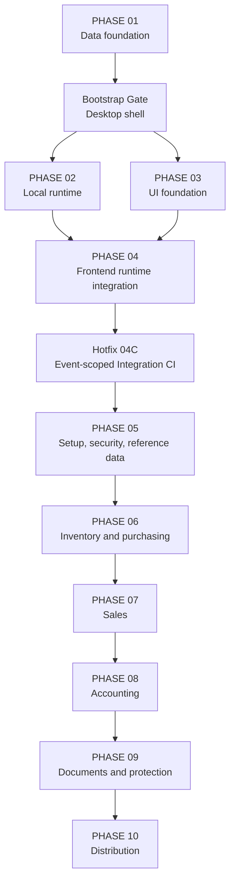

# POSMAN Master Engineering Roadmap — PHASE 01 to PHASE 10

> Status contract: PHASE 01–04 and Hotfix 04C are accepted facts. PHASE 05–10 are planned boundaries only and are not authorized merely because they appear here.

## 1. Delivery sequence

| Delivery unit | Status | Accepted SHA or boundary |
| --- | --- | --- |
| PHASE 01 | Accepted | `0c72eb75eb5db916a51d1ee42fec47f21328ad28` |
| Bootstrap Gate 02/03 | Accepted | `a4165e28fb3bf8693d8023742e2ac2e7cc5db7d9` |
| PHASE 02 | Accepted | `7112e7f029a6419c7e58f89947f66ccad8bb69e4` |
| PHASE 03 | Accepted | `f4cda85b24f9d69ebb0442c02f8a037da8ba9baf` |
| PHASE 04 | Accepted | `a86635a8bc7dd8f3b7683f8f2f33d40c454441bb` |
| POST-MERGE HOTFIX 04C | Accepted | `73c3afed19c8bf4841d0c65fc85b7d0c4c3ef307` |
| PHASE 05 | Planned; unstarted; unauthorized | First-run, security, and reference data |
| PHASE 06 | Planned; unauthorized | Inventory and purchasing |
| PHASE 07 | Planned; unauthorized | Sales and transformation |
| PHASE 08 | Planned; unauthorized | Accounting posting |
| PHASE 09 | Planned; unauthorized | Documents, reports, audit, and backup |
| PHASE 10 | Planned; unauthorized | Distribution and v1 release |

## 2. Dependency map

## PHASE 01 — SQLite Data Foundation

**Status:** Accepted through PR #1 at `0c72eb75eb5db916a51d1ee42fec47f21328ad28`.

Delivered:

- Four ordered migrations, 49 tables, and 25 integrity triggers.
- Deterministic reference seed and generated schema.
- Cross-platform verification and positive/negative invariant tests.
- Fixed-point data contract.
- Append-only inventory and immutable posted-history protections.

Preserve:

- Never edit an accepted migration.
- Never use `REAL` for business truth.
- Future aggregate transformed-quantity enforcement belongs in one Rust transaction.

Reference: [PHASE 01 report](../PHASE-01-REPORT.md).

## Bootstrap Gate 02/03 — Shared Desktop Shell

**Status:** Accepted through PR #2 at `a4165e28fb3bf8693d8023742e2ac2e7cc5db7d9`.

Delivered:

- Tauri 2 + React + TypeScript + Vite desktop shell.
- Explicit CSP, minimal capability, and offline build/runtime boundary.
- Ubuntu and Windows validation.
- Accepted Common Controls v6 manifest solution.
- Ownership contract for parallel PHASE 02 and PHASE 03 work.

Reference: [Bootstrap Gate report](../BOOTSTRAP-GATE-02-REPORT.md).

## PHASE 02 — Local Runtime Foundation

**Status:** Accepted through PR #3 at `7112e7f029a6419c7e58f89947f66ccad8bb69e4`.

Delivered:

- Bundled SQLite through `rusqlite`.
- Local POSMAN data directories.
- Embedded migration and seed execution with exact ledger hash checks.
- Safe rejection of gaps, drift, and newer schemas.
- Readiness validation and managed `RuntimeService`.
- Single read-only sanitized Tauri command: `get_runtime_status`.

Excluded: all business commands, CRUD, frontend invocation, inventory calculation, accounting posting, printing, and backup.

Reference: [PHASE 02 report](../PHASE-02-REPORT.md).

## PHASE 03 — Original UI Foundation

**Status:** Accepted through PR #4 at `f4cda85b24f9d69ebb0442c02f8a037da8ba9baf`.

Delivered:

- Contemporary Operations Ledger visual direction.
- Arabic `ar-DZ` default with RTL and French `fr-DZ` with LTR.
- Typed dictionaries, `Intl` formatting, design tokens, and logical CSS.
- Reusable operational components and fixture gallery screens.
- Keyboard, responsive, overflow, reduced-motion, and Axe evidence.

Excluded: Tauri invocation, persistence, authentication, CRUD, calculations, posting, printing, backup, installer, network, cloud, and telemetry.

Reference: [PHASE 03 report](../PHASE-03-REPORT.md).

## PHASE 04 — Frontend Runtime Integration

**Status:** Accepted through PR #6 at `a86635a8bc7dd8f3b7683f8f2f33d40c454441bb`.

Delivered:

- Central typed Tauri gateway under `src/platform/tauri/**`.
- Invocation of `get_runtime_status` only.
- Runtime payload validation and safe error normalization.
- Explicit `initializing`, `ready`, `error`, and browser `preview` states.
- Retry, stale-response suppression, unmount protection, and React StrictMode deduplication.
- Arabic RTL and French LTR runtime integration.
- Controlled development-only browser adapter seam with production-hook rejection.
- Frontend integration tests, browser evidence, Rust IPC coverage, and dedicated read-only Integration CI.

Excluded:

- New Rust business commands.
- Company setup, authentication, general CRUD, stock writes, sales, accounting, printing, backup, or installer.
- SQL, database paths, stack traces, or raw internal errors in the frontend.

References: [PHASE 04 report](../PHASE-04-REPORT.md) and [integration architecture](../architecture/frontend-runtime-integration.md).

## POST-MERGE HOTFIX 04C — Integration CI Event Scope

**Status:** Accepted through PR #7 at `73c3afed19c8bf4841d0c65fc85b7d0c4c3ef307`.

Delivered:

- Removed the fixed PHASE 03 ownership baseline.
- Pull-request and push ownership ranges derive from the triggering event.
- Removed unused `workflow_call` after caller verification.
- Preserved read-only permissions, write guard, Integration checks, and ownership evidence.

No PHASE 04 product source or PHASE 05 work was added.

Reference: [Hotfix 04C report](../HOTFIX-04C-REPORT.md).

## PHASE 05 — First-Run Setup, Security, and Reference Data

**Status:** Planned, unstarted, and unauthorized.

Candidate purpose:

- Create a usable empty company after installation.
- Company identity, activity, legal fields, default language, and DZD context.
- Fiscal year and periods.
- Initial warehouse/location.
- Administrator, password hashing, login, session, inactivity lock, roles, and permissions.
- Configurable units, taxes, payment methods, families, products, prices, customers, and suppliers.

Required architecture:

- Rust services own validation, permissions, idempotency, audit, and transactions.
- Typed request/response DTOs and safe errors.
- Repositories isolate SQL.
- UUIDv7 IDs generated in Rust.
- Arabic/French UX and resumable setup.

Must resolve before implementation:

- Password hashing and recovery policy.
- Exact Algeria company/legal fields.
- Fiscal-year creation UX.
- Tax rounding and price-margin rules.
- Initial document sequence formats.

Out of scope: stock posting, purchasing, sales, accounting posting, PDF/report engine, backup, and installer.

## PHASE 06 — Inventory and Purchasing

**Status:** Planned and unauthorized.

Candidate scope:

- Opening stock, inventory movements, balances, reservations, counts, and adjustments.
- Negative-stock policy and permission-controlled exceptions.
- Purchase orders/receipts/invoices as product decisions require.
- Returns through compensating records.
- Moving-average CUMP/CMUP.
- Rebuild and reconciliation of `stock_balances` from `stock_movements`.

Critical gates:

- Every stock effect is append-only and idempotent.
- Repeated submission cannot duplicate movement.
- CUMP is fixed-point and deterministic.
- Posted movement history remains immutable.

## PHASE 07 — Sales and Document Transformation

**Status:** Planned and unauthorized.

Candidate scope:

- Direct invoice and order → delivery → invoice workflows.
- Partial delivery, lineage, reservations, returns, and correction documents.
- Deterministic fixed-point totals, tax, discounts, and payment terms.
- Aggregate source-line transformed quantity enforced in one Rust transaction.

Critical gates:

- No over-transformation.
- Delivered quantities drive downstream invoicing.
- Retry cannot double-reserve, double-move stock, or duplicate documents.
- Posted documents remain immutable.

## PHASE 08 — Automatic Accounting Posting

**Status:** Planned and unauthorized.

Candidate scope:

- Configurable accounts and posting rules.
- Fiscal-period validation.
- Idempotent document-to-journal posting.
- Balanced entries with traceability.
- Reversal and compensating corrections.

Critical gates:

- No partial journal entry.
- Missing configuration produces an actionable error.
- Posted journals and lines are immutable.

## PHASE 09 — Documents, Printing, Reports, Audit, and Backup

**Status:** Planned and unauthorized.

Candidate scope:

- Versioned safe HTML/CSS templates without arbitrary JavaScript.
- Preview, validated PDF/printing path, and immutable historical render snapshots.
- Operational reports and exports.
- Audit presentation.
- Manual and automatic backup/restore with compatibility and corruption checks.

Critical gates:

- Reprint reproduces the historical document.
- Restore never destroys the current database before validation and safety backup.
- Private data remains local.

## PHASE 10 — Distribution, Hardening, and POSMAN v1.0.0

**Status:** Planned and unauthorized.

Candidate scope:

- Offline Windows installer and WebView2 strategy.
- Signing strategy when credentials are available.
- Clean-machine install, upgrade, uninstall, and data-preservation tests.
- Performance, accessibility, security, recovery, and release evidence.

Critical gates:

- One normal installation; no developer tools or database server.
- Upgrade/uninstall does not silently remove customer data.
- No secrets or signing material in Git.
- v1 release only after all prior accepted gates are green.
