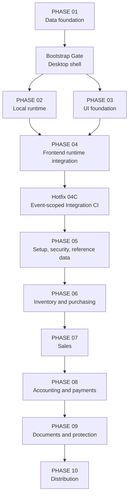

# POSMAN Master Engineering Roadmap — PHASE 01 to PHASE 10

> Status contract: PHASE 01–08 and POST-MERGE HOTFIX 04C are accepted facts on `main`. PHASE 09–10 remain planned boundaries and are not authorized merely because they appear here.

## 1. Delivery sequence

| Delivery unit | Status | Accepted SHA or boundary |
| --- | --- | --- |
| PHASE 01 | Accepted | `0c72eb75eb5db916a51d1ee42fec47f21328ad28` |
| Bootstrap Gate 02/03 | Accepted | `a4165e28fb3bf8693d8023742e2ac2e7cc5db7d9` |
| PHASE 02 | Accepted | `7112e7f029a6419c7e58f89947f66ccad8bb69e4` |
| PHASE 03 | Accepted | `f4cda85b24f9d69ebb0442c02f8a037da8ba9baf` |
| PHASE 04 | Accepted | `a86635a8bc7dd8f3b7683f8f2f33d40c454441bb` |
| POST-MERGE HOTFIX 04C | Accepted | `73c3afed19c8bf4841d0c65fc85b7d0c4c3ef307` |
| PHASE 05 | Accepted | `ccf2263104455681cc07ecceda2569c4f7ce0de9` |
| PHASE 06 | Accepted | `036ac89c07ddee1e26402c1c523529adbba48860` |
| PHASE 07 | Accepted | `ae133cea9c3b6760a5fd22b38d3169aa2f976dc6` |
| PHASE 08 | Accepted | `5821004c6f3a51b4b0116ec3dbc1b9c2264ccf69` |
| PHASE 09 | Planned, unstarted, unauthorized | Documents, printing, reports, audit, and backup |
| PHASE 10 | Planned, unauthorized | Distribution, hardening, and v1 release |

## 2. Dependency map

## PHASE 01 — SQLite Data Foundation

**Status:** Accepted through PR #1.

Delivered:

- ordered SQLite migrations, deterministic seed, generated schema, cross-platform verification, and invariant tests;
- fixed-point data contract;
- commercial lineage, append-only inventory, balanced accounting structures, and immutable posted-history protections.

Preserve:

- never edit an accepted migration;
- never use `REAL` for business truth;
- corrections are roll-forward migrations.

Reference: [PHASE 01 report](../PHASE-01-REPORT.md).

## Bootstrap Gate 02/03 — Shared Desktop Shell

**Status:** Accepted through PR #2.

Delivered:

- Tauri 2 + React + TypeScript + Vite desktop shell;
- explicit CSP, minimal capability, and offline runtime boundary;
- Ubuntu/Windows validation and Common Controls v6 manifest.

Reference: [Bootstrap Gate report](../BOOTSTRAP-GATE-02-REPORT.md).

## PHASE 02 — Local Runtime Foundation

**Status:** Accepted through PR #3.

Delivered:

- bundled SQLite through `rusqlite`;
- application-owned local directories;
- embedded migration/seed execution with exact ledger checks;
- safe rejection of gaps, drift, and newer schemas;
- configured SQLite connections and sanitized runtime readiness.

Reference: [PHASE 02 report](../PHASE-02-REPORT.md).

## PHASE 03 — Original UI Foundation

**Status:** Accepted through PR #4.

Delivered:

- Contemporary Operations Ledger visual direction;
- Arabic `ar-DZ` default with RTL and French `fr-DZ` with LTR;
- typed dictionaries, `Intl` formatting, design tokens, logical CSS, reusable operational components, and accessibility evidence.

Reference: [PHASE 03 report](../PHASE-03-REPORT.md).

## PHASE 04 — Frontend Runtime Integration

**Status:** Accepted through PR #6.

Delivered:

- central typed Tauri gateway under `src/platform/tauri/**`;
- payload validation, safe error normalization, retry, stale-response suppression, unmount protection, and StrictMode deduplication;
- Arabic/French runtime integration, controlled development adapters, integration tests, and dedicated CI.

Reference: [PHASE 04 report](../PHASE-04-REPORT.md).

## POST-MERGE HOTFIX 04C — Integration CI Event Scope

**Status:** Accepted through PR #7.

Delivered:

- event-scoped ownership ranges for Pull Requests and pushes;
- removal of unused `workflow_call`;
- preserved read-only permissions, write guard, validation gates, and evidence generation.

Reference: [Hotfix 04C report](../HOTFIX-04C-REPORT.md).

## PHASE 05 — First-Run Setup, Security, and Reference Data

**Status:** Accepted through PR #8 at `ccf2263104455681cc07ecceda2569c4f7ce0de9`.

Delivered:

- atomic first-run setup, company/fiscal configuration, document sequences, taxes, margins, and below-cost policy;
- Argon2id authentication, sessions, inactivity lock, recovery-code rotation, users, roles, and permissions;
- products, families, units, prices, warehouses, locations, customers, suppliers, addresses, contacts, payment methods, and payment terms;
- company scope, authorization, audit, idempotency/concurrency controls, typed Tauri commands, and Arabic/French operational UI;
- migration `0005` and permanent CI.

Reference: [PHASE 05 report](../PHASE-05-REPORT.md).

## PHASE 06 — Inventory and Purchasing

**Status:** Accepted through PR #10 at `036ac89c07ddee1e26402c1c523529adbba48860`.

Delivered:

- append-only inventory ledger, rebuildable balances, moving CUMP/CMUP, opening stock, adjustments, transfers, counts, reservations, and negative-stock controls;
- reconciliation/rebuild and deterministic fixed-point calculations;
- purchase orders, partial/full receipts, supplier invoices, direct receive-and-invoice, and purchase returns;
- atomic posting, company-scoped idempotency, permissions, audit, typed gateways, Arabic/French UI, and cross-platform CI.

Critical accepted gates:

- repeated submissions cannot duplicate stock effects;
- posted stock history remains immutable;
- CUMP is deterministic and fixed-point.

Reference: [PHASE 06 report](../PHASE-06-REPORT.md).

## PHASE 07 — Sales and Document Transformation

**Status:** Accepted through PR #11 at `ae133cea9c3b6760a5fd22b38d3169aa2f976dc6`.

Delivered:

- sales orders, reservations, confirmation, hold/resume/cancel;
- partial/full delivery, delivery-backed invoicing, direct sale, returns, credit documents, and lineage;
- transactional aggregate transformation limits;
- deterministic fixed-point HT/tax/TTC/discount calculations and warehouse-CUMP below-cost policy;
- typed Tauri commands, Arabic/French Sales Workbench, tests, and CI.

Critical accepted gates:

- no over-transformation;
- retry cannot double-reserve, double-move stock, or duplicate documents;
- posted commercial documents remain immutable.

Reference: [PHASE 07 report](../PHASE-07-REPORT.md).

## PHASE 08 — Automatic Accounting, Payments, and Settlement

**Status:** Accepted through PR #12 at `5821004c6f3a51b4b0116ec3dbc1b9c2264ccf69`.

Delivered:

- chart of accounts, accounting journals, semantic account-role mappings, and configurable multi-line posting rules;
- atomic automatic posting for sales, purchases, returns, stock/COGS-related events, safe retry history, and idempotency;
- manual journals, posting, linked reversals, and immutable posted entries;
- customer receipts, supplier payments, allocations, allocation reversal, and payment reversal;
- partner statements, cash/bank register, trial balance, general/account ledgers, open receivables/payables, and fiscal-period controls;
- migration `0006`, 35 typed Tauri commands, Arabic/French accounting workspace, and full CI/evidence.

Critical accepted gates:

- no partial journal entry;
- missing/ambiguous configuration fails closed;
- source, stock, journal, audit, and idempotency success are atomic where required;
- posted journals remain immutable.

Reference: [PHASE 08 report](../PHASE-08-REPORT.md).

## PHASE 09 — Documents, Printing, Reports, Audit, and Backup

**Status:** Planned, unstarted, and unauthorized.

Candidate scope:

- versioned safe HTML/CSS templates without arbitrary JavaScript;
- preview, validated PDF/printing path, content hashes, and immutable historical render snapshots;
- operational reports and exports;
- permission-controlled audit presentation;
- manual and automatic backup/restore with compatibility, integrity, corruption, and safety-backup checks.

Existing foundation:

- accepted schema tables for templates, template versions, rendered documents, attachments, audit logs, and backup history;
- application-owned directories for documents, templates, backups, and logs;
- operational business data and queries from PHASE 05–08.

Must resolve before implementation:

- PDF/printing engine and Windows printer strategy;
- template sanitization and version-publishing contract;
- initial report/export matrix;
- backup retention/encryption policy;
- safe SQLite WAL backup and restore mechanism;
- exact Tauri capability boundary for dialogs/files/printing.

Critical gates:

- reprint reproduces the historical document;
- restore never replaces current data before compatibility/integrity checks and a verified safety backup;
- frontend receives no unrestricted filesystem access;
- private data remains local.

## PHASE 10 — Distribution, Hardening, and POSMAN v1.0.0

**Status:** Planned and unauthorized.

Candidate scope:

- offline Windows installer and WebView2 strategy;
- signing strategy when credentials are available;
- clean-machine install, upgrade, uninstall, and data-preservation tests;
- performance on supported low-memory devices;
- accessibility, security, recovery, and release evidence;
- versioning, release notes, and final v1 artifacts.

Critical gates:

- one normal installation with no developer tools or database server;
- upgrade/uninstall does not silently remove customer data;
- no secrets or signing material in Git;
- v1 release only after PHASE 09 is accepted and all release gates are green.
