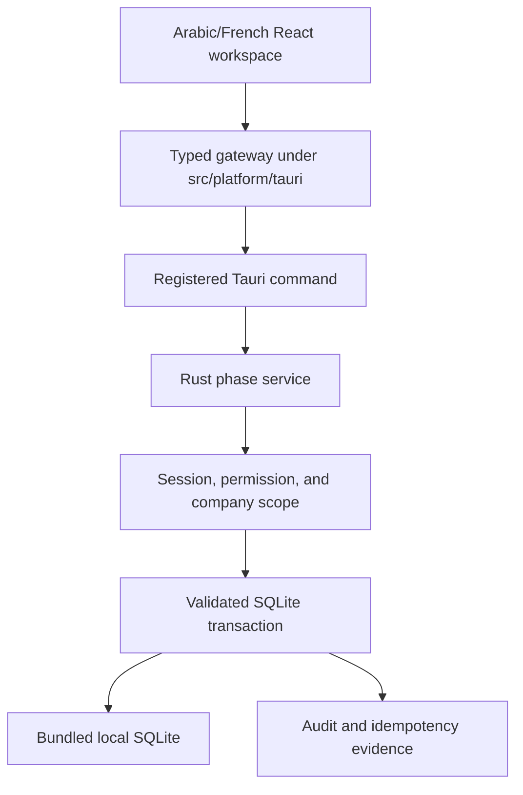

# POSMAN Project Tree and Ownership Map

> Accepted product baseline through PHASE 08: `5821004c6f3a51b4b0116ec3dbc1b9c2264ccf69`. Verify live `main` before acting. Generated dependencies, build output, runtime databases, documents, and backups are excluded from Git.

## 1. Repository tree represented by this checkpoint

```text
posman-desktop/
├── .github/
│   ├── pull_request_template.md
│   └── workflows/
│       ├── schema-ci.yml
│       ├── desktop-bootstrap-ci.yml
│       ├── runtime-ci.yml
│       ├── ui-ci.yml
│       ├── integration-ci.yml
│       ├── phase05-ci.yml
│       ├── phase06-ci.yml
│       ├── phase07-ci.yml
│       └── phase08-ci.yml
├── database/
│   ├── migrations/
│   │   ├── 0001_system_company_security.sql
│   │   ├── 0002_reference_catalog_partners.sql
│   │   ├── 0003_commerce_inventory.sql
│   │   ├── 0004_accounting_documents_audit.sql
│   │   ├── 0005_setup_security_reference_data.sql
│   │   └── 0006_accounting_payments_hardening.sql
│   ├── schema.sql
│   ├── seed/reference_data.sql
│   └── tests/invariants.sql
├── scripts/
│   ├── verify_schema.py
│   ├── verify_phase06.py
│   ├── verify_phase07.py
│   ├── verify_phase08.py
│   ├── phase06_policy.py
│   ├── phase07_policy.py
│   └── phase08_policy.py
├── docs/
│   ├── PHASE-01-REPORT.md ... PHASE-08-REPORT.md
│   ├── BOOTSTRAP-GATE-02-REPORT.md
│   ├── HOTFIX-04C-REPORT.md
│   ├── architecture/
│   │   ├── database/runtime/integration foundations
│   │   ├── phase-05-setup-security-reference-data.md
│   │   ├── phase-06-inventory-purchasing.md
│   │   ├── phase-07-sales-cycle.md
│   │   └── phase-08-accounting-payments.md
│   ├── design/
│   ├── spec/POSMAN-Blueprint-v1.md
│   ├── continuity/
│   │   ├── PROJECT-MEMORY-INDEX.md
│   │   ├── CURRENT-STATE.md
│   │   ├── AI-OPERATING-CONTRACT.md
│   │   ├── MASTER-ROADMAP-PHASES-01-10.md
│   │   ├── DECISION-REGISTER.md
│   │   ├── PROJECT-TREE.md
│   │   └── RECOVERY-PROMPT.md
│   └── execution-packs/archive/
├── src/
│   ├── app/AppRoot.tsx
│   ├── components/
│   ├── features/
│   │   ├── runtime/
│   │   ├── ui-gallery/
│   │   ├── phase05/
│   │   ├── phase06/
│   │   ├── phase07/
│   │   └── phase08/
│   ├── i18n/
│   ├── platform/tauri/
│   │   ├── runtime-environment.ts
│   │   ├── runtime-status.ts
│   │   ├── phase05.ts
│   │   ├── phase06.ts
│   │   ├── phase07.ts
│   │   └── phase08.ts
│   └── styles/
├── tests/
│   ├── e2e/
│   │   ├── run_ui_gallery.py
│   │   ├── run_phase06.py
│   │   ├── run_phase07.py
│   │   └── run_phase08.py
│   ├── integration/
│   │   ├── runtime-status.test.ts
│   │   ├── phase05-gateway.test.ts
│   │   ├── phase06-gateway.test.ts
│   │   ├── phase06-request-gate.test.ts
│   │   ├── phase07-gateway.test.ts
│   │   └── phase08-gateway.test.ts
│   └── ui/
│       ├── i18n-fixtures.test.ts
│       ├── phase06-ui-contract.test.ts
│       ├── phase07-ui-contract.test.ts
│       └── phase08-ui-contract.test.ts
└── src-tauri/
    ├── Cargo.toml
    ├── Cargo.lock
    ├── build.rs
    ├── capabilities/default.json
    ├── tauri.conf.json
    ├── windows-app-manifest.xml
    └── src/
        ├── lib.rs
        ├── main.rs
        ├── error.rs
        ├── application/
        ├── commands/
        │   ├── runtime.rs
        │   ├── phase05.rs
        │   ├── phase06.rs
        │   ├── phase07.rs
        │   └── phase08.rs
        ├── infrastructure/
        │   ├── paths.rs
        │   └── database/
        ├── phase05/
        ├── phase06/
        ├── phase07/
        └── phase08/
```

## 2. Responsibility by area

| Path | Responsibility | Accepted truth |
| --- | --- | --- |
| `database/migrations/**` | Authoritative ordered schema changes | Six accepted immutable migrations through `0006` |
| `database/schema.sql` | Generated review snapshot | Must match ordered migrations exactly |
| `database/seed/**` | Deterministic safe reference data | Must remain idempotent and synthetic |
| `scripts/verify_schema.py` | Cross-platform schema/invariant verification | Must remain green |
| `scripts/verify_phase06.py` | Inventory/purchasing contract guard | Protects accepted PHASE 06 boundary |
| `scripts/verify_phase07.py` | Sales contract guard | Protects accepted PHASE 07 boundary |
| `scripts/verify_phase08.py` | Accounting/payment contract guard | Protects accepted PHASE 08 boundary |
| `src-tauri/src/infrastructure/**` | Paths, connections, embedded migrations, database setup | Shared local runtime foundation |
| `src-tauri/src/phase05/**` | Setup, security, administration, catalogue, and partners | Accepted business services |
| `src-tauri/src/phase06/**` | Inventory, CUMP, purchasing, reservations, and reconciliation | Accepted business services |
| `src-tauri/src/phase07/**` | Sales, transformation, direct sale, returns, and pricing | Accepted business services |
| `src-tauri/src/phase08/**` | Accounting, posting, payments, allocations, and queries | Accepted business services |
| `src-tauri/src/commands/**` | Typed Tauri IPC boundary | Runtime and PHASE 05–08 commands are registered |
| `src-tauri/src/lib.rs` | Tauri setup, service state, and command registration | Shared integration point through PHASE 08 |
| `src/platform/tauri/**` | Typed frontend gateways and safe boundary normalization | Runtime and PHASE 05–08 gateways |
| `src/features/phase05/**` | Administration/reference UI | Operational and persisted through Tauri |
| `src/features/phase06/**` | Inventory/purchasing UI | Operational and persisted through Tauri |
| `src/features/phase07/**` | Sales UI | Operational and persisted through Tauri |
| `src/features/phase08/**` | Accounting/payment UI | Operational and persisted through Tauri |
| `src/features/ui-gallery/**` | Demonstration fixtures | Not business truth |
| `src/i18n/**` | Arabic/French dictionaries, context, and formatters | RTL/LTR and key parity required |
| `tests/integration/**` | Typed gateway and frontend boundary behavior | Accepted regression layer |
| `tests/e2e/**` | Browser accessibility/layout/language evidence | Uses controlled development adapters |
| `.github/workflows/**` | Cross-platform validation and phase ownership gates | Read-only permissions and write guards |
| `docs/continuity/**` | Recovery state, authority, decisions, roadmap, and ownership | Must follow live accepted `main` |
| `docs/execution-packs/archive/**` | Historical execution records | Evidence only, never active by default |

## 3. Accepted application flow



The exact transaction shape depends on the phase, but React does not execute SQL and cannot bypass Rust authorization or validation.

## 4. Accepted domain ownership

### Setup and reference data

`phase05` owns first-run setup, authentication, sessions, company/fiscal configuration, users, roles, permissions, products, partners, warehouses, prices, and related reference data.

### Inventory and purchasing

`phase06` owns stock movements/projections, CUMP, opening stock, adjustments, transfers, counts, reservations, reconciliation/rebuild, and purchase workflows.

### Sales

`phase07` owns sales orders, delivery/invoice transformations, direct sale, returns/credits, lineage, totals, and below-cost enforcement.

### Accounting and payments

`phase08` owns accounts, journals, posting rules, automatic/manual entries, reversals, receipts/payments, allocations, statements, registers, trial balance, ledgers, open balances, and fiscal-period controls.

## 5. PHASE 09 planned growth

PHASE 09 may add, after explicit authorization:

```text
src-tauri/src/phase09/**
src-tauri/src/commands/phase09.rs
src/platform/tauri/phase09.ts
src/features/phase09/**
tests for document rendering, reports, audit, backup, and restore
.github/workflows/phase09-ci.yml
docs/PHASE-09-REPORT.md
docs/architecture/phase-09-*.md
```

Do not create empty PHASE 09 modules before authorization.

PHASE 09 must integrate with existing schema tables and application-owned directories while preserving a narrow capability boundary. The frontend must not gain unrestricted filesystem access.

## 6. Files that must never be committed

Because the repository is public, never commit:

- `node_modules/`, `dist/`, or Rust `target/`;
- `.env` files or any secret, credential, token, private key, certificate, or signing material;
- runtime `.sqlite`, `.sqlite3`, WAL, SHM, or journal files;
- production, recovered, or customer databases;
- real company, customer, supplier, employee, or authentication data;
- generated backups, private PDFs/documents, logs, screenshots, or diagnostic bundles.
