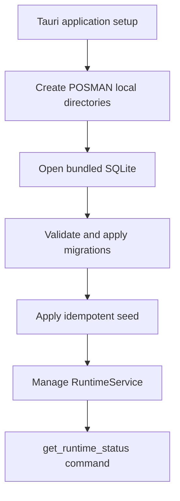
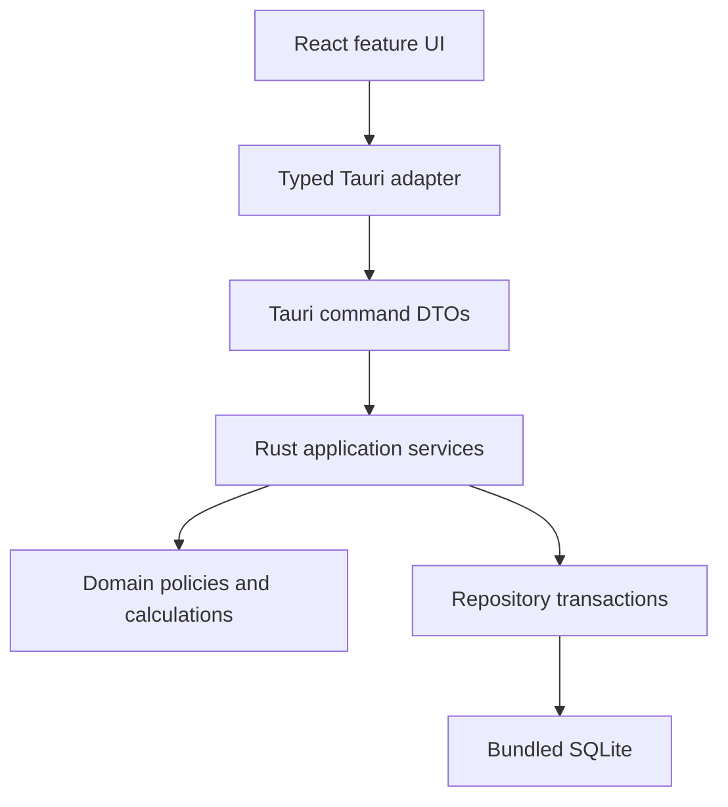

# POSMAN Project Tree and Ownership Map

> Verified product tree at `main` SHA `f4cda85b24f9d69ebb0442c02f8a037da8ba9baf`, plus continuity files proposed by Draft PR #5. Generated build output, dependency folders, and local runtime data are intentionally excluded from Git.

## 1. Current repository tree

```text
posman-desktop/
├── .editorconfig
├── .gitattributes
├── .gitignore
├── AGENTS.md
├── README.md
├── index.html
├── package.json
├── package-lock.json
├── tsconfig.json
├── tsconfig.app.json
├── tsconfig.node.json
├── vite.config.ts
│
├── .github/
│   ├── pull_request_template.md
│   └── workflows/
│       ├── schema-ci.yml
│       ├── desktop-bootstrap-ci.yml
│       ├── runtime-ci.yml
│       └── ui-ci.yml
│
├── database/
│   ├── migrations/
│   │   ├── 0001_system_company_security.sql
│   │   ├── 0002_reference_catalog_partners.sql
│   │   ├── 0003_commerce_inventory.sql
│   │   └── 0004_accounting_documents_audit.sql
│   ├── schema.sql
│   ├── seed/
│   │   └── reference_data.sql
│   └── tests/
│       └── invariants.sql
│
├── scripts/
│   └── verify_schema.py
│
├── docs/
│   ├── BOOTSTRAP-GATE-02-REPORT.md
│   ├── PHASE-01-REPORT.md
│   ├── PHASE-02-REPORT.md
│   ├── PHASE-03-REPORT.md
│   ├── spec/
│   │   └── POSMAN-Blueprint-v1.md
│   ├── architecture/
│   │   ├── accounting-posting.md
│   │   ├── data-dictionary.md
│   │   ├── database-decisions.md
│   │   ├── desktop-shell.md
│   │   ├── erd.md
│   │   ├── migration-policy.md
│   │   ├── parallel-wave-02-contract.md
│   │   ├── runtime-command-contracts.md
│   │   └── runtime-database.md
│   ├── design/
│   │   ├── component-inventory.md
│   │   ├── direction-study.md
│   │   └── ui-foundation.md
│   ├── continuity/                         # Draft PR #5
│   │   ├── PROJECT-MEMORY-INDEX.md
│   │   ├── CURRENT-STATE.md
│   │   ├── AI-OPERATING-CONTRACT.md
│   │   ├── MASTER-ROADMAP-PHASES-01-10.md
│   │   ├── DECISION-REGISTER.md
│   │   ├── PROJECT-TREE.md
│   │   └── RECOVERY-PROMPT.md
│   └── execution-packs/                    # Draft PR #5
│       └── archive/
│           ├── README.md
│           ├── PHASE-01-DATA-FOUNDATION.md
│           ├── BOOTSTRAP-GATE-02-03-DESKTOP-SHELL.md
│           ├── PHASE-02-RUNTIME-FOUNDATION.md
│           ├── PHASE-03-ORIGINAL-UI-FOUNDATION.md
│           └── patches/
│               ├── PATCH-01A-SQLITE-INTEGRITY.md
│               ├── PATCH-01B-WINDOWS-RUST-TEST.md
│               └── PATCH-01C-TAURI-WINDOWS-MANIFEST.md
│
├── public/
│   └── fonts/
│       └── OFL.txt
│
├── src/
│   ├── main.tsx
│   ├── vite-env.d.ts
│   ├── app/
│   │   └── AppRoot.tsx
│   ├── bootstrap/
│   │   └── bootstrap.css
│   ├── components/
│   │   ├── layout.tsx
│   │   ├── operational.tsx
│   │   └── primitives.tsx
│   ├── features/
│   │   └── ui-gallery/
│   │       ├── screens.tsx
│   │       └── fixtures/
│   │           └── index.ts
│   ├── i18n/
│   │   ├── I18nProvider.tsx
│   │   ├── dictionaries.ts
│   │   └── formatters.ts
│   └── styles/
│       ├── tokens.css
│       └── ui-foundation.css
│
├── tests/
│   ├── e2e/
│   │   └── run_ui_gallery.py
│   └── ui/
│       └── i18n-fixtures.test.ts
│
└── src-tauri/
    ├── Cargo.toml
    ├── Cargo.lock
    ├── build.rs
    ├── tauri.conf.json
    ├── windows-app-manifest.xml
    ├── capabilities/
    │   └── default.json
    ├── icons/
    │   ├── 32x32.png
    │   ├── 128x128.png
    │   ├── 128x128@2x.png
    │   └── icon.ico
    └── src/
        ├── main.rs
        ├── lib.rs
        ├── error.rs
        ├── application/
        │   ├── mod.rs
        │   └── runtime_status.rs
        ├── commands/
        │   ├── mod.rs
        │   └── runtime.rs
        └── infrastructure/
            ├── mod.rs
            ├── paths.rs
            └── database/
                ├── mod.rs
                ├── connection.rs
                ├── migrations.rs
                └── tests.rs
```

## 2. Responsibility by area

| Path | Responsibility | Current truth |
| --- | --- | --- |
| `database/**` | Authoritative accepted SQLite source and invariants | Four migrations; do not edit |
| `scripts/verify_schema.py` | Cross-platform schema/invariant verifier | Must remain green |
| `src-tauri/src/infrastructure/**` | Paths, connections, migrations, embedded database setup | Runtime foundation only |
| `src-tauri/src/application/**` | Application-level DTO/service state | Only runtime status exists |
| `src-tauri/src/commands/**` | Tauri IPC command boundary | Only `get_runtime_status` exists |
| `src-tauri/src/lib.rs` | Tauri setup, managed state, command registration | Shared integration point |
| `src/**` | React UI and original design foundation | Fixture-only; no backend call |
| `src/app/AppRoot.tsx` | Current UI gallery composition and local view state | Shared PHASE 04 integration point |
| `src/components/**` | Layout, operational, and primitive components | Accepted design primitives |
| `src/features/ui-gallery/**` | Reference screens and fixtures | Demonstration, not business implementation |
| `src/i18n/**` | Arabic/French dictionaries, context, formatters | Must keep key parity |
| `src/styles/**` | Accepted tokens and UI foundation | Avoid override patch accumulation |
| `tests/ui/**` | Dictionary/fixture tests | Browser-independent |
| `tests/e2e/**` | Visual, accessibility, layout, overflow evidence | Uses fixture gallery |
| `.github/workflows/**` | Schema, desktop, runtime, and UI gates | Do not weaken |
| `docs/**` | Product, architecture, reports, design, continuity, history | Durable source of context |

## 3. Current runtime flow



The React UI does not yet call `get_runtime_status`.

## 4. Intended business architecture



Rules:

- React owns interaction and presentation, not business truth.
- Commands translate safe typed requests/responses.
- Application services coordinate permissions, idempotency, transactions, and audit.
- Domain modules calculate totals, stock, transformations, and posting.
- Infrastructure owns SQL, paths, rendering, backup, and OS integration.

## 5. Planned tree growth

Future phases are expected to add bounded areas rather than place all logic in `lib.rs` or `AppRoot.tsx`:

```text
src/
├── platform/tauri/          # typed invoke adapter; PHASE 04 candidate
├── features/setup/
├── features/security/
├── features/catalog/
├── features/partners/
├── features/inventory/
├── features/purchasing/
├── features/sales/
├── features/accounting/
├── features/documents/
├── features/reports/
└── features/backup/

src-tauri/src/
├── domain/
│   ├── money/
│   ├── security/
│   ├── catalog/
│   ├── inventory/
│   ├── purchasing/
│   ├── sales/
│   └── accounting/
├── application/
│   ├── setup/
│   ├── catalog/
│   ├── inventory/
│   ├── purchasing/
│   ├── sales/
│   ├── accounting/
│   ├── documents/
│   └── backup/
├── commands/
├── infrastructure/
│   ├── repositories/
│   ├── printing/
│   ├── backup/
│   └── audit/
└── error.rs
```

This is a target boundary, not permission to create empty modules or implement later phases early. Every active phase must inspect the live tree and select the smallest necessary paths.

## 6. Files that must never be committed

- `node_modules/`
- `dist/`
- Rust `target/`
- `.env` or real secrets
- Runtime `.sqlite`, `.sqlite3`, WAL, SHM, or journal files
- Real company/customer data
- Generated backups, PDFs, logs, or installer artifacts unless an approved release process explicitly publishes them as GitHub artifacts/releases
- Temporary transfer, materializer, diagnostic, or commit-log helper files
