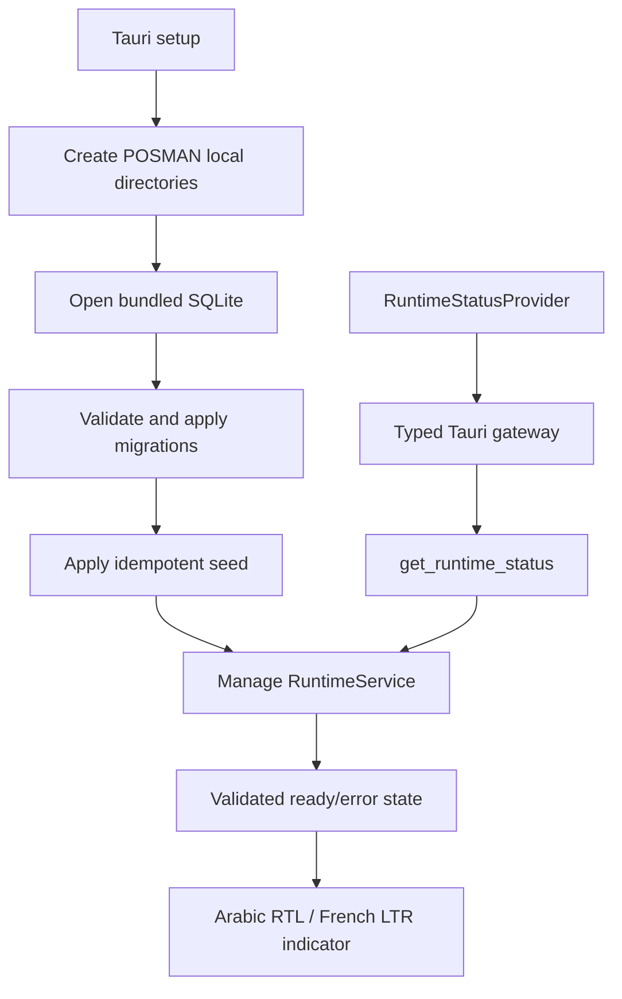

# POSMAN Project Tree and Ownership Map

> Verified accepted product tree at `main` SHA `73c3afed19c8bf4841d0c65fc85b7d0c4c3ef307`, plus continuity files maintained in Draft PR #5. Generated dependencies, build output, and local runtime data are excluded from Git.

## 1. Current repository tree

```text
posman-desktop/
├── .github/
│   └── workflows/
│       ├── schema-ci.yml
│       ├── desktop-bootstrap-ci.yml
│       ├── runtime-ci.yml
│       ├── ui-ci.yml
│       └── integration-ci.yml
├── database/
│   ├── migrations/0001...0004
│   ├── schema.sql
│   ├── seed/reference_data.sql
│   └── tests/invariants.sql
├── scripts/verify_schema.py
├── docs/
│   ├── PHASE-01-REPORT.md
│   ├── BOOTSTRAP-GATE-02-REPORT.md
│   ├── PHASE-02-REPORT.md
│   ├── PHASE-03-REPORT.md
│   ├── PHASE-04-REPORT.md
│   ├── HOTFIX-04C-REPORT.md
│   ├── architecture/
│   │   ├── database-decisions.md
│   │   ├── desktop-shell.md
│   │   ├── runtime-database.md
│   │   ├── runtime-command-contracts.md
│   │   └── frontend-runtime-integration.md
│   ├── design/
│   │   ├── direction-study.md
│   │   ├── component-inventory.md
│   │   └── ui-foundation.md
│   ├── spec/POSMAN-Blueprint-v1.md
│   ├── continuity/
│   │   ├── PROJECT-MEMORY-INDEX.md
│   │   ├── CURRENT-STATE.md
│   │   ├── AI-OPERATING-CONTRACT.md
│   │   ├── MASTER-ROADMAP-PHASES-01-10.md
│   │   ├── DECISION-REGISTER.md
│   │   ├── PROJECT-TREE.md
│   │   └── RECOVERY-PROMPT.md
│   └── execution-packs/archive/
├── src/
│   ├── app/AppRoot.tsx
│   ├── components/
│   ├── features/
│   │   ├── ui-gallery/
│   │   └── runtime/
│   │       ├── RuntimeStatusIndicator.tsx
│   │       ├── RuntimeStatusProvider.tsx
│   │       ├── runtime-state.ts
│   │       └── runtime-status.css
│   ├── i18n/
│   ├── platform/
│   │   └── tauri/
│   │       ├── runtime-environment.ts
│   │       └── runtime-status.ts
│   └── styles/
├── tests/
│   ├── e2e/run_ui_gallery.py
│   ├── integration/runtime-status.test.ts
│   └── ui/i18n-fixtures.test.ts
└── src-tauri/
    ├── Cargo.toml
    ├── Cargo.lock
    ├── build.rs
    ├── tauri.conf.json
    ├── windows-app-manifest.xml
    └── src/
        ├── lib.rs
        ├── main.rs
        ├── error.rs
        ├── application/runtime_status.rs
        ├── commands/runtime.rs
        └── infrastructure/
            ├── paths.rs
            └── database/
```

## 2. Responsibility by area

| Path | Responsibility | Current accepted truth |
| --- | --- | --- |
| `database/**` | Authoritative SQLite schema, seed, and invariants | Four accepted migrations; do not edit |
| `scripts/verify_schema.py` | Cross-platform database verification | Must remain green |
| `src-tauri/src/infrastructure/**` | Paths, connections, embedded migrations, database setup | Runtime foundation only |
| `src-tauri/src/application/**` | Application-level state/services | Runtime status only |
| `src-tauri/src/commands/**` | Tauri IPC boundary | Only `get_runtime_status` |
| `src-tauri/src/lib.rs` | Tauri setup, managed state, command registration | Accepted shared integration point |
| `src/platform/tauri/**` | Typed frontend gateway, environment detection, payload/error boundary | Accepted PHASE 04 integration layer |
| `src/features/runtime/**` | Runtime provider, state machine, indicator, localized presentation | Read-only health UI |
| `src/features/ui-gallery/**` | Demonstration screens and fixtures | Not business implementation |
| `src/i18n/**` | Arabic/French dictionaries, context, and formatting | Key parity and RTL/LTR required |
| `tests/integration/**` | Frontend runtime gateway/provider behavior | Includes retry, stale response, error, and StrictMode coverage |
| `tests/e2e/**` | Browser accessibility, layout, language, and runtime-state evidence | Controlled preview/mock path |
| `.github/workflows/integration-ci.yml` | Event-scoped PHASE 04 integration gate | Read-only permissions and write guard |
| `docs/**` | Blueprint, accepted evidence, architecture, continuity, and historical packs | Durable project context |

## 3. Current runtime flow



Only runtime health crosses this boundary. No business write path exists.

## 4. Hotfix 04C CI flow

```text
pull_request:
  merge-base target branch ... triggering PR head

push:
  event before .. event sha
```

The resolved range drives ownership enforcement, evidence metadata, and final whitespace/worktree comparison. `workflow_call` is absent. Permissions remain read-only.

## 5. Planned bounded growth

PHASE 05 may add first-run, security, catalogue, and partner areas only after authorization. Later planned growth includes inventory, purchasing, sales, accounting, documents, reports, backup, and distribution. Do not create empty modules or implement later phases early.

## 6. Files that must never be committed

Because the repository is public, never commit:

- `node_modules/`, `dist/`, or Rust `target/`;
- `.env` files or any secret/credential/private key;
- runtime `.sqlite`, `.sqlite3`, WAL, SHM, or journal files;
- production, recovered, or customer databases;
- real company, customer, supplier, employee, or authentication data;
- generated backups, private PDFs/documents, logs, screenshots, or diagnostic bundles;
- signing certificates or installer secrets.
